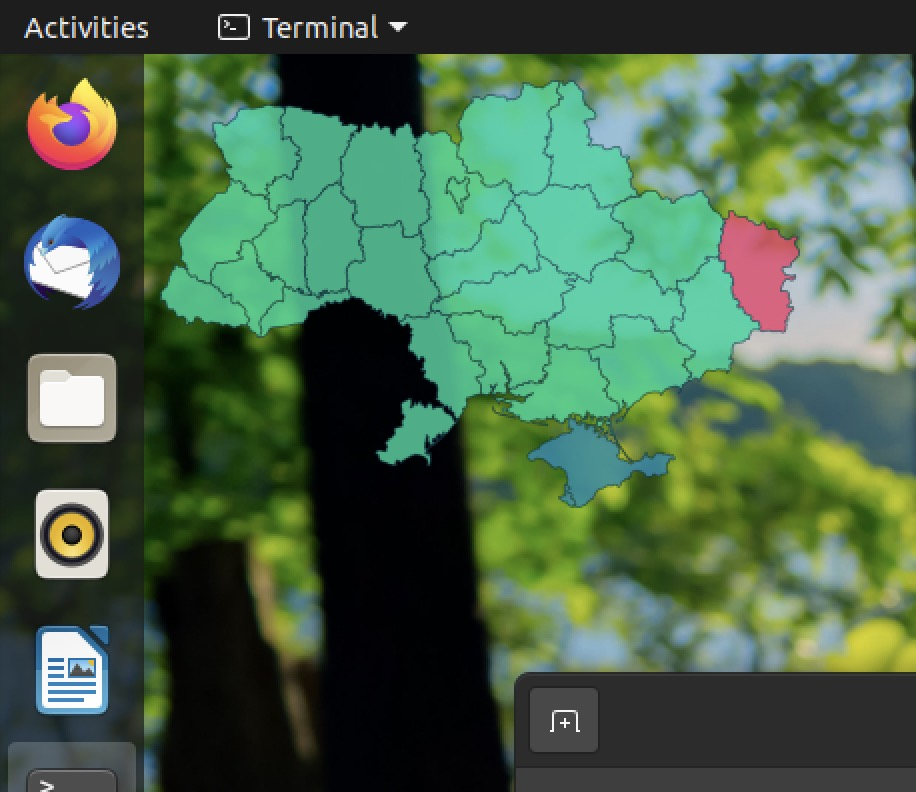

# Air raid widget for Linux



This widget shows the current status of air raid sirens in Ukraine. The data is pulled every 20 seconds
from https://sirens.in.ua/

#### Version of this widget for other platforms:

* [Windows](https://github.com/dr-mod/air-raid-widget-windows)
* [macOS](https://github.com/dr-mod/air-raid-widget-macos)
* [RaspberryPi](https://github.com/dr-mod/air-raid-monitor)

## Installation

### Gnome

1. Install Gnome extensions
   ```
   sudo apt install gnome-shell-extensions
   ```
2. Download the widget
   ```
   git clone https://github.com/dr-mod/air-raid-widget-linux.git
   ```
3. Copy the widget to your Gnome shell extensions folder
   ```
   cp -r air-raid-widget-linux/air-raid-monitor@sirens.in.ua ~/.local/share/gnome-shell/extensions/
   ```
4. Widgets can be enabled through console, therefore in our case
   ```
   gnome-extensions enable air-raid-monitor@sirens.in.ua
   ```
   and if you wish to disable it
   ```
   gnome-extensions disable air-raid-monitor@sirens.in.ua
   ```
   widgets can also be configured though other GUI management tools available in your distro, e.g. Tweaks, _Tweaks -> Extensions_. 

